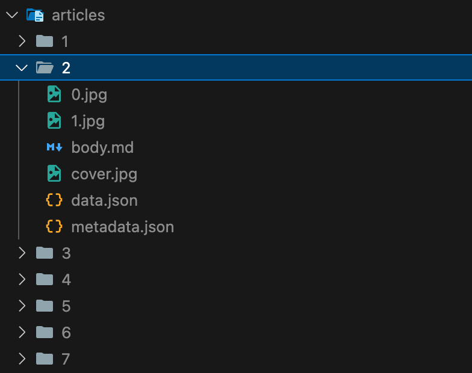

# Brunch Backup 브런치 백업저장기
- Backup Brunch articles to Markdown files.
- 브런치 글과 이미지를 마크다운 파일로 저장합니다.

## Usage
1. Install Deno
2. Update backupArticles.ts (BASE_URL and number of pages to backup)
3. Run the script

```bash
deno run backupArticles.ts
```

## Example
코드 실행시 폴더 안에 아래 파일이 생성됩니다. 이미지도 다운로드 되어 md파일에 연결됩니다.

1. metadata.json: 제목, 부제목, 날짜
```json
{
  "title": "Brunch Article Title",
  "subtitle": "Article Subtitle",
  "date": "2025-02-23"
}
```

2. body.md: 글 본문
```
# 브런치 글이 그대로 저장됩니다.
이미지도 같은 폴더 안에 저장됩니다.
이런 구조로 저장되며, 폴더 이름은 글 번호(url 맨 마지막 숫자)입니다.
```

3. images: 이미지들

아래와 같이 이미지도 같은 폴더 안에 저장됩니다.



## Notes
- 이 코드는 본인 브런치 글 백업 용도입니다.
- 크롤링, 오남용 및 저작권 위반 등으로 인한 책임은 사용자에게 있습니다.
- Only for personal use, use AYOR, only backup if you own the rights to the content
- Also downloads json from attr `data-app` (unused)
- Unsupported: Bullet points, Variations of Quotes, Alignments, Image size, Fonts, etc.